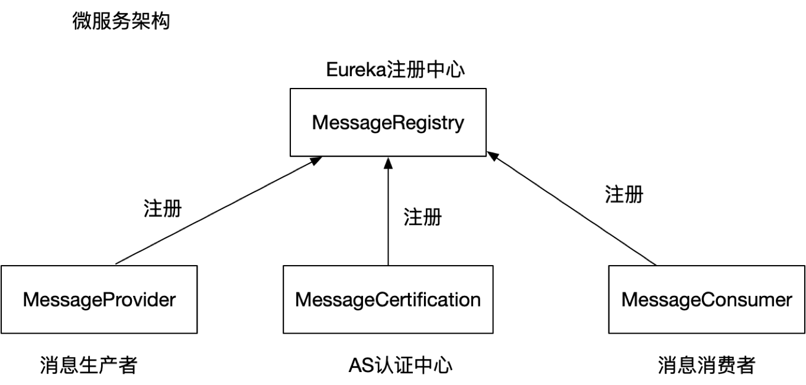

# 概述
消息中间件:RabbitMQ

加密: AES+RSA混合加密

## MessageRegistry 注册中心

## MessageCertification 认证中心

## MessageProvider 发送方-客户端

## MessageConsumer 接收方-服务器

## MessageCommon 公共类
aes 对称加密

rsa 非对称加密,一般用公钥加密,用私钥解密

